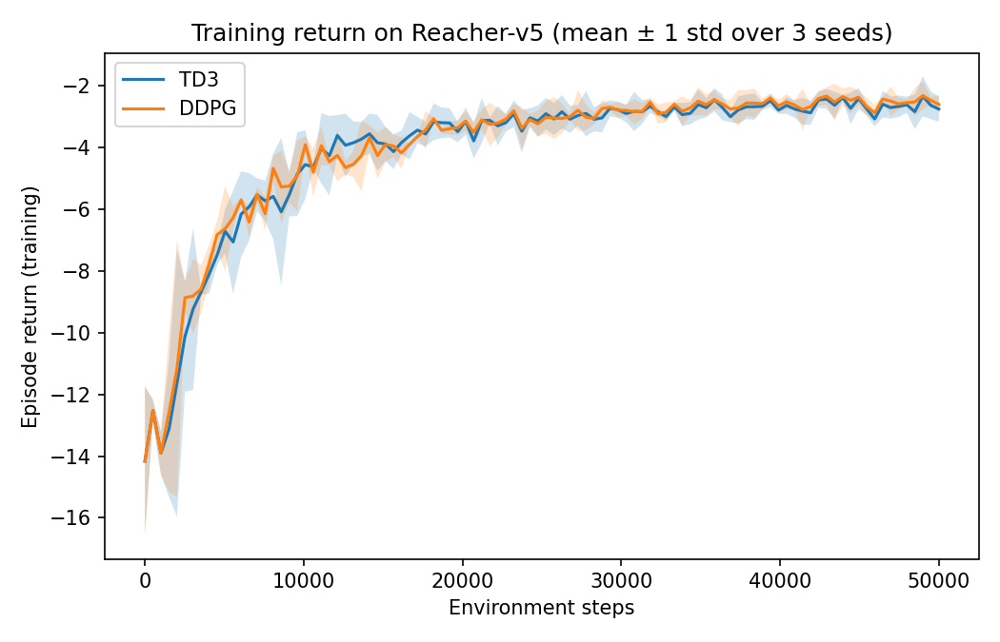

# 1. Introduction

**Problem.** The task is to control a simulated two-joint robotic arm so that its fingertip reaches a target that is redrawn every episode. The environment is Gymnasium MuJoCo Reacher-v5 (Towers et al., 2024; Farama Foundation, 2024). Actions are continuous torques at the two hinges. The catalogue domain is robotics and industrial automation: the same structure appears in pick-and-place and inspection, where an end effector must be driven to a pose without a hand-written path.

**Significance.** Reaching is a small problem, but it is the right kind of small problem for an off-policy actor-critic method. The action space is continuous, so discrete algorithms such as DQN do not apply. The dynamics are those of a rigid arm in MuJoCo (Todorov, Erez and Tassa, 2012), which is the physics engine used throughout much of the continuous-control literature. The interesting scientific question is not whether a high score is possible. It is whether TD3's extras, relative to DDPG, change behaviour when both methods see the same Markov Decision Process (MDP), the same seeds and the same evaluation episodes. The examination paper is explicit that a group whose agent fails to beat its baseline can still score if the failure is diagnosed. That is the standard we apply here.

**Aims.** First, to write Reacher-v5 as an MDP with an explicit state, action, reward, termination, truncation and discount, and to say whether the representation is Markov. Second, to train Twin Delayed Deep Deterministic policy gradient (TD3; Fujimoto, van Hoof and Meger, 2018) using Stable-Baselines3 2.9.0 (Raffin et al., 2021), without treating the library optimiser as original work. Third, to compare TD3 with DDPG (Lillicrap et al., 2016) and with a random continuous controller under one protocol: seeds 0, 1 and 2, 50,000 steps, thirty held-out deterministic episodes per seed, and the five catalogue metrics (success rate, final distance, time to target, control effort, cumulative reward).

# 2. Background

**Algorithm selected.** TD3 is an off-policy actor-critic method for continuous actions. It extends Deep Deterministic Policy Gradient (DDPG; Lillicrap et al., 2016), which itself implements the deterministic policy gradient of Silver et al. (2014) with replay and target networks in the style of DQN. A deterministic actor $\mu_\theta(s)$ is trained against a critic $Q_\phi(s,a)$. Fujimoto et al. (2018) argued that this still overestimates $Q$: the actor climbs peaks in a biased critic, and those peaks are then reinforced. TD3 makes three changes. Two critics are learned and the target uses their minimum (clipped Double $Q$-learning, after van Hasselt, Guez and Silver, 2016). The actor is updated less often than the critics. Clipped noise is added to the target action so that $Q$ is not fitted to a knife-edge.

**Why TD3 suits this problem.** Candidate actions in the catalogue are continuous joint torques. A discrete algorithm would require a binning that we do not want. Among continuous methods, DDPG is the required baseline family; TD3 is the specified agent and differs from DDPG only in the three extras above. If those extras matter on Reacher, the gap should appear when nothing else is changed. If they do not, the honest report is that they did not, not that the implementation failed.

**Prior work in the domain.** MuJoCo was introduced as a fast simulator for articulated robots (Todorov, Erez and Tassa, 2012). DDPG was shown on a suite of simulated physics tasks, including manipulation-style problems (Lillicrap et al., 2016). TD3 was evaluated on the OpenAI Gym continuous-control suite that includes Reacher-type arms (Fujimoto, van Hoof and Meger, 2018; Brockman et al., 2016). Gymnasium is the maintained successor to Gym and is the API required by this examination (Towers et al., 2024). We use Gymnasium only. We are not claiming to match published benchmark scores; the brief says that is not expected in fourteen days.

# 3. Problem formulation

The control problem is the discounted MDP $(S,A,P,R,\gamma)$. $P$ is the MuJoCo transition; we do not estimate it.

## 3.1 State space

The observation is the 10-dimensional Reacher-v5 vector. Components: $\cos q_0$, $\cos q_1$, $\sin q_0$, $\sin q_1$, target $(x,y)$, $\dot q_0$, $\dot q_1$, and the planar fingertip-minus-target vector. Types are trigonometric functions of hinge angles, Cartesian positions and angular velocities. We applied no running normalisation.

Cosine and sine avoid wrapping a raw angle at $\pm\pi$. The target is required, otherwise one pose would have to serve every goal. Velocities are required for a second-order arm; position alone is not enough if the next pose depends on how fast the links already move. Catalogue candidates also listed end-effector position and distance to target. End-effector position is implicit in the last two entries once the target is known. Distance is $\| \cdot \|_2$ of those two entries; we did not duplicate it in the vector. Those last two entries are derived from kinematics and the target. We kept them because the library returns them and because they are exactly the quantity the distance reward uses. We did not add a previous-action bit or a binary "reached" flag.

**Markov property.** For this simulated planar arm, if commanded torque is applied immediately and the target is fully observed, joint angles, joint velocities and the target determine the next physical state. What is missing is anything a real actuator would have: current, temperature, cable stretch, latency. Those quantities are not in the simulator, so they are not missing from the observation of the simulator. They are missing from any claim about hardware. We did not compensate with recurrence or history; we treated the 10-vector as Markov in simulation.

## 3.2 Action space

Actions are continuous, $a\in[-1,1]^2$. Each component is the torque at one hinge, in the environment's units. Stable-Baselines3 squashes the actor into that box. We did not apply a second scale.

## 3.3 Reward

Let $d_t=\|p_{\mathrm{fingertip},t}-p_{\mathrm{target}}\|_2$ in the plane. The reward used for every headline run is

$$
r_t = -w_{\mathrm{dist}}\,d_t - w_{\mathrm{ctrl}}\,\|a_t\|_2^2 + b\,\mathbf{1}[d_t<\varepsilon],
$$

with $w_{\mathrm{dist}}=1$, $w_{\mathrm{ctrl}}=0.1$, $b=0$ and $\varepsilon=0.05$. The indicator is unused in training. $\varepsilon$ is used only when scoring success and time-to-target.

The three catalogue reward candidates are all present in this equation: negative distance, a control-effort penalty, and a reach bonus that we set to zero. A dense $-d_t$ plus a sparse bonus would pay twice for the same event. The target is drawn in a disk of radius 0.2, so $d_t$ is typically a few tenths at reset. $\|a_t\|_2^2\le 2$. With $w_{\mathrm{ctrl}}=0.1$ the effort term is not negligible once the fingertip is close. The Gymnasium 1.3.0 constructor default for Reacher-v5 is $w_{\mathrm{ctrl}}=1$ (the docstring still says 0.1). Our runs are therefore a shaped variant, not a match to the installed native default. The weights were not changed after evaluation.

## 3.4 Termination and truncation

**Termination.** The environment never terminates. Entering the $\varepsilon$-ball does not end the episode. We left that as `success_termination=False`. Ending on success would shorten good trajectories and mix a change of MDP with a change of algorithm.

**Truncation.** Episodes are cut off at 50 steps by Gymnasium's `TimeLimit`. That is a timeout, not a goal. Stable-Baselines3 2.9.0 records `TimeLimit.truncated` and, with default `handle_timeout_termination=True`, does not treat those cutoffs as bootstrap-zero terminals. Folding truncation into `terminated` would train every timeout as if no further return existed.

## 3.5 Discount

$\gamma=0.98$. The scale $1/(1-\gamma)$ is 50 steps, equal to the episode length. The library default 0.99 has scale 100, twice the horizon we actually run. We froze 0.98 against that horizon and held it fixed across methods and seeds.

# 4. Methodology

## 4.1 Environment construction

Python 3.10 or later; Gymnasium API only. The wrapper around `Reacher-v5` records $d_t$, $\|a_t\|_2^2$ and a success flag in `info`, and optionally terminates on success (off for the headline). A second wrapper replaces the library reward with the equation in Section 3.3 so that the weights are ours. Observation construction is the library 10-vector; we did not mask actions.

## 4.2 Network architecture and training

Both TD3 and DDPG use `MlpPolicy`: two hidden layers of 256 units with ReLU, which differs from the SB3 2.9.0 default of 400 then 300 for this policy. Optimiser Adam, learning rate $10^{-3}$. Training: 50,000 environment steps per run, Gaussian action noise of standard deviation 0.1, replay starts after 1,000 steps. One gradient step per environment step. PyTorch is the backend supplied by Stable-Baselines3.

No hyperparameter search was conducted. In particular, nothing was selected on the evaluation episodes.

## 4.3 Baseline design

The required baseline is DDPG or a random continuous controller. We used both. DDPG is trained by the same function as TD3; only the algorithm class and the three TD3-only arguments differ. The random controller samples $A$ uniformly and exposes `predict` so that it shares the evaluation loop. DDPG isolates the TD3 extras. Random is the floor.

## 4.4 Protocol

Seeds are **0, 1 and 2**. Hyperparameters in Table 2 are constant across those seeds and across TD3 and DDPG except the three TD3-only rows. Evaluation uses seed $s+10{,}000$, thirty episodes per seed, and `deterministic=True` for the learned policies (exploration disabled). The random controller has no deterministic mode; the flag is accepted so the loop is identical. All five catalogue metrics are computed by the same code for every method. A per-seed mean is taken over 30 episodes; the headline is the mean of those three means with the sample standard deviation. We do not report a $p$-value. Three seeds cannot support one.

Table 2. Hyperparameters. SB3 2.9.0 TD3 defaults in the last column. Held fixed across seeds 0, 1 and 2.

| Setting | This project | SB3 2.9.0 default |
|---------|--------------|-------------------|
| `learning_rate` | $10^{-3}$ | $10^{-3}$ |
| `buffer_size` | 200,000 | 1,000,000 |
| `learning_starts` | 1,000 | 100 |
| `batch_size` | 256 | 256 |
| `tau` | 0.005 | 0.005 |
| `gamma` | 0.98 | 0.99 |
| `train_freq` / `gradient_steps` | 1 / 1 | 1 / 1 |
| `net_arch` | $[256,256]$ | $[400,300]$ |
| action noise | $\mathcal{N}(0,0.1^2)$ | none |
| `policy_delay` (TD3) | 2 | 2 |
| `target_policy_noise` (TD3) | 0.2 | 0.2 |
| `target_noise_clip` (TD3) | 0.5 | 0.5 |
| `total_timesteps` | 50,000 | --- |

Where compute is limited the brief says to cut steps, not seeds. 50,000 steps is the budget we ran; we did not drop below three seeds.

## 4.5 Metrics

Cumulative reward is $\sum_t r_t$. Final distance is $d$ at the last step. Success is 1 if that last $d$ is below 0.05. Time to target is the first 1-based step with $d_t<0.05$, or missing if the ball is never entered; seed means ignore missing values. Control effort is the mean of $\|a_t\|_2^2$. Success uses the end of the episode; time to target uses the first crossing. An episode can contribute a time-to-target and still fail. Training curves are mean $\pm$ 1 standard deviation of episode return against environment steps, from committed `logs/train_*.csv`.

# 5. Results

Table 1 reports every required metric as mean $\pm$ sample standard deviation over seeds 0, 1 and 2. Thirty deterministic held-out episodes contribute to each seed. Length was 50 in every evaluated rollout (truncation).

Table 1. Held-out evaluation. Mean $\pm$ sample standard deviation over three seeds.

| Method | Return | Success | Final dist. | Time to target | Effort |
|--------|--------|---------|-------------|----------------|--------|
| TD3 | $-2.449\pm 0.211$ | $0.989\pm 0.019$ | $0.011\pm 0.003$ | $11.37\pm 0.90$ | $0.083\pm 0.006$ |
| DDPG | $-2.401\pm 0.093$ | $1.000\pm 0.000$ | $0.010\pm 0.002$ | $10.69\pm 0.52$ | $0.085\pm 0.004$ |
| random | $-12.815\pm 0.932$ | $0.078\pm 0.038$ | $0.169\pm 0.015$ | $23.80\pm 1.73$ | $0.660\pm 0.011$ |

The random controller does not solve the task: success about 8%, final distance about 0.17, effort about 0.66. Both learned methods put the fingertip inside 0.05 at the end of almost every episode (DDPG on all 90 trials; TD3 missed a few, all on seed 0). Final distances are about 0.01. Time to first crossing is a little over 10 steps. Returns are about $-2.4$. DDPG is slightly ahead on return and success; TD3 is slightly lower on effort. None of those TD3--DDPG gaps exceeds the combined across-seed spread. Three seeds cannot support a claim that the methods differ. Per-seed values are in Appendix A. TD3 seed 2 (return $-2.21$) is not the headline.

Figure 1 is training return against environment steps, mean and one standard deviation across the three seeds, regenerated from the committed CSVs. Those curves include exploration noise, so they are not on the same footing as Table 1.

{ width=80% }

# 6. Discussion

## 6.1 Convergence

Figure 1 shows both methods leaving the random-controller range early in the 50,000 steps and then flattening. Evaluation success is already at the ceiling for DDPG and nearly so for TD3. Remaining improvement, if any, is in return and effort, not in whether the fingertip arrives. 50,000 steps is 1,000 truncated episodes. We do not treat the missing TD3 gap as under-training.

## 6.2 Training stability

The shaded band in Figure 1 is the seed-to-seed spread of training return. Neither method shows a seed that diverges while the others learn. DDPG's evaluation standard deviations are smaller than TD3's on return and success. TD3 seed 0 is the only learned cell below 1.0 success (0.967). That is variation, not a collapsed run. With $n=3$ we cannot separate a slightly noisier learner from luck.

## 6.3 Exploration

Training uses isotropic Gaussian noise on the torque, $\sigma=0.1$, independent across the two hinges. Evaluation uses the deterministic actor (`deterministic=True`). The random baseline is that noise taken to the extreme: uniform samples from $A$ with no actor. The gap between random and the learned methods shows that the Gaussian schedule, together with replay, was enough to find reaching behaviour. It does not show that $\sigma=0.1$ is optimal. We did not compare OU noise, as in the original DDPG paper, with the Gaussian default used here.

## 6.4 Effect of reward design

The effort weight is visible in Table 1: learned mean $\|a\|_2^2$ is about 0.08 against 0.66 for random. The distance weight pulls the fingertip in; the effort term is what keeps torque small after arrival, because episodes are not cut on success and the remaining steps still accumulate $-w_{\mathrm{ctrl}}\|a\|^2$. We cannot say 0.1 is the right weight. We did not sweep it. Changing it after seeing Table 1 would not be a fair ablation. Setting $b=0$ means success is an evaluation label only; the agent is not trained on a sparse reach bonus on top of $-d_t$.

# 7. Limitations and deployment

The result is for a simulated two-link arm with instantaneous torque. A physical manipulator has bandwidth, backlash, identified friction and delay (Todorov, Erez and Tassa, 2012, discuss the gap between simulation and hardware control even when the engine is built for robots). We did no domain randomisation and no system identification. The saved policy should not be expected to track a real fingertip.

The box $[-1,1]^2$ is not a motor datasheet. Saturating it is cheap in MuJoCo. On hardware, chatter at the stops heats a gearbox. We penalised $\|a_t\|_2^2$, not action derivatives.

There is no safety layer in the MDP: no kinetic-energy cap, no barrier, no stop. Reacher never terminates on collision because the model is a planar arm and a target, not a contact task. A continuous policy used near people would need limits outside the actor.

Reaching without contact does not speak to grasping, friction or peg-in-hole. Those are not small variants of this MDP.

Success and time-to-target are not the same event, as defined in Section 4. Evaluation targets come from a second seed stream, not a published coordinate list. $n=3$ reports a spread and does not support a strong comparative claim.

# 8. Conclusion and further work

We formulated Reacher-v5 as an MDP, trained TD3, and compared it with DDPG and a random torque controller under one protocol. The learned policies reach the target; the random controller does not. At 50,000 steps and seeds 0, 1 and 2, TD3 and DDPG do not separate beyond seed-to-seed variation. The extras that define TD3 did not show up as a gain on this short, densely rewarded reaching task.

A useful next experiment would change the reward or the horizon so that overestimation has somewhere to appear, while keeping the same seeds and metric code. Searching TD3 on the present table until it wins would not test that mechanism.

# References

Brockman, G., Cheung, V., Pettersson, L., Schneider, J., Schulman, J., Tang, J. and Zaremba, W. (2016) 'OpenAI Gym', arXiv:1606.01540.

Farama Foundation (2024) *Reacher*. Gymnasium documentation. Available at: https://gymnasium.farama.org/environments/mujoco/reacher/ (accessed 4 September 2026). Version as installed: Gymnasium 1.3.0.

Fujimoto, S., van Hoof, H. and Meger, D. (2018) 'Addressing function approximation error in actor-critic methods', *Proceedings of the 35th International Conference on Machine Learning*, PMLR 80, pp. 1587--1596.

Lillicrap, T.P., Hunt, J.J., Pritzel, A., Heess, N., Erez, T., Tassa, Y., Silver, D. and Wierstra, D. (2016) 'Continuous control with deep reinforcement learning', *International Conference on Learning Representations*.

Raffin, A., Hill, A., Gleave, A., Kanervisto, A., Ernestus, M. and Dormann, N. (2021) 'Stable-Baselines3: Reliable reinforcement learning implementations', *Journal of Machine Learning Research*, 22(268), pp. 1--8.

Silver, D., Lever, G., Heess, N., Degris, T., Wierstra, D. and Riedmiller, M. (2014) 'Deterministic policy gradient algorithms', *Proceedings of the 31st International Conference on Machine Learning*, PMLR 32, pp. 387--395.

Todorov, E., Erez, T. and Tassa, Y. (2012) 'MuJoCo: A physics engine for model-based control', *2012 IEEE/RSJ International Conference on Intelligent Robots and Systems*, pp. 5026--5033.

Towers, M. et al. (2024) 'Gymnasium: A standard interface for reinforcement learning environments', arXiv:2407.17032.

van Hasselt, H., Guez, A. and Silver, D. (2016) 'Deep reinforcement learning with Double Q-learning', *Proceedings of the AAAI Conference on Artificial Intelligence*, 30(1).

# Appendix A. Per-seed evaluation

Means over 30 deterministic episodes. These are the numbers behind Table 1, not alternative headlines.

| Method | Seed | Return | Final distance | Success | Time to target | Effort |
|--------|-----:|--------|----------------|---------|----------------|--------|
| TD3 | 0 | $-2.594$ | $0.0142$ | $0.967$ | $12.23$ | $0.085$ |
| TD3 | 1 | $-2.546$ | $0.0096$ | $1.000$ | $11.43$ | $0.088$ |
| TD3 | 2 | $-2.207$ | $0.0078$ | $1.000$ | $10.43$ | $0.076$ |
| DDPG | 0 | $-2.361$ | $0.0113$ | $1.000$ | $10.63$ | $0.085$ |
| DDPG | 1 | $-2.507$ | $0.0080$ | $1.000$ | $11.23$ | $0.088$ |
| DDPG | 2 | $-2.334$ | $0.0112$ | $1.000$ | $10.20$ | $0.081$ |
| random | 0 | $-12.745$ | $0.179$ | $0.100$ | $22.71$ | $0.649$ |
| random | 1 | $-13.780$ | $0.152$ | $0.100$ | $25.80$ | $0.671$ |
| random | 2 | $-11.919$ | $0.176$ | $0.033$ | $22.89$ | $0.661$ |

# Appendix B. Environment as installed

Gymnasium 1.3.0, MuJoCo 3.12.0, Stable-Baselines3 2.9.0. `Reacher-v5`: observation `Box(10,)`, action `Box(-1,1,(2,))`, native constructor weights $w_{\mathrm{dist}}=1$, $w_{\mathrm{ctrl}}=1$, truncates at 50 steps, never terminates.

# Appendix C. Reproduction

Logs: `logs/train_*.csv`. Figure 1: `python run.py --plot`. Table 1: `python run.py --eval`. Configuration: `src/config.py`.
